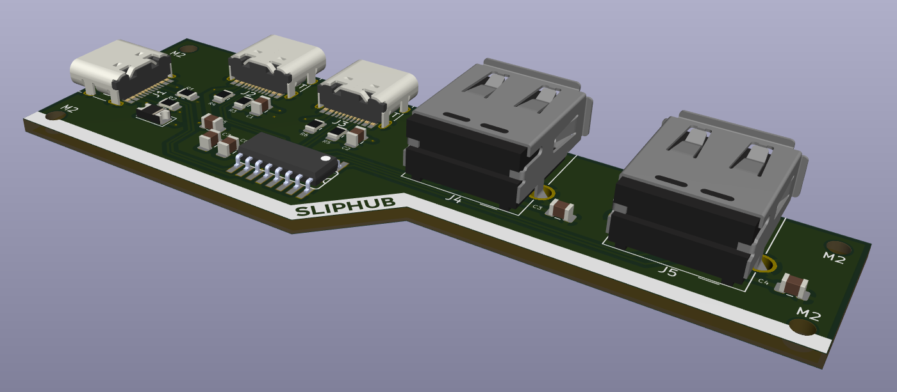

# July 23rd 
today i did some researach on USB hubs... initially i planned on having 2 USB A, 1 USB C, and 1 HDMI, but i learned that it was probably wise to avoid HDMI due to the complications that arise from implementation, so now its just another USB C port making for 1 of each type!

additionally i created my schematic :3

### hours spent: 4

# July 24th
routed my pcb today! 

after that i made my case in fusion too! its supposed to mimic the look of my [slipboard](https://github.com/ila-io/slipboard/tree/main) hackpad, since im trying to build out a cohesive ecosystem of accesories for my surface pro! 

now i'm all done, just have to upload all the files to github and submit! 

### Hours spent: 7
