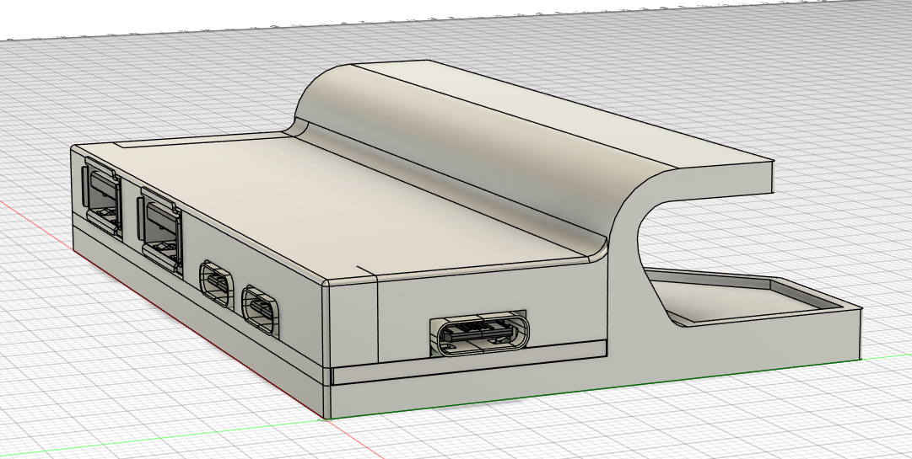
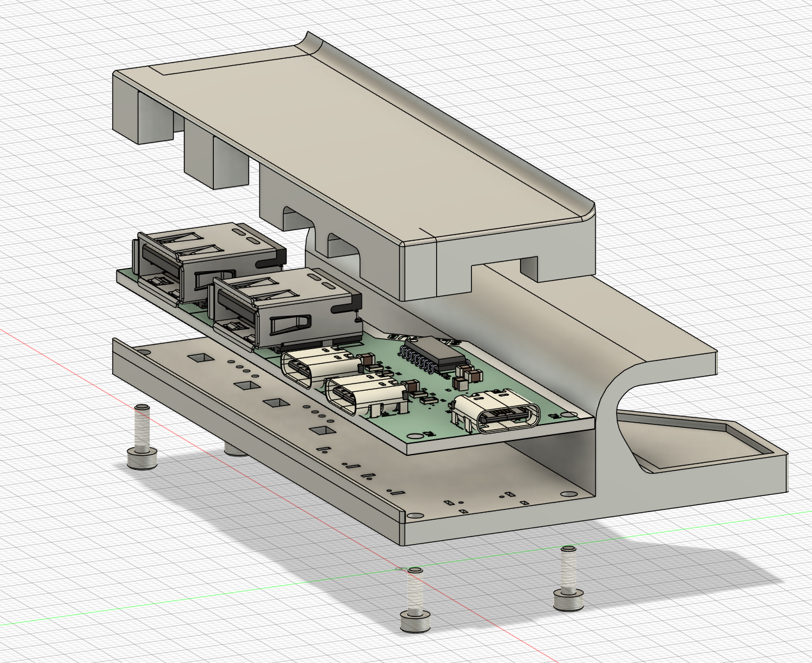
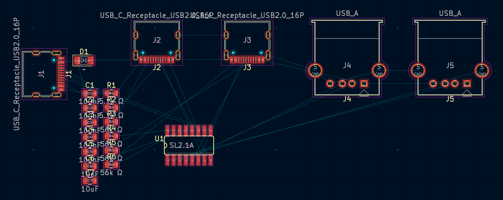
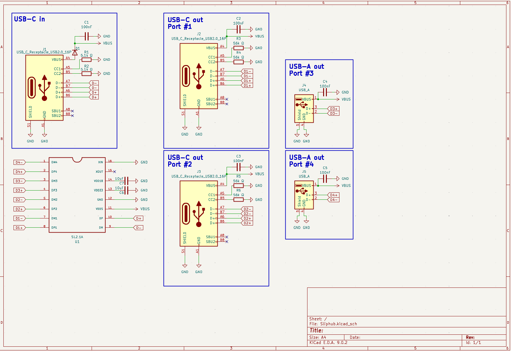
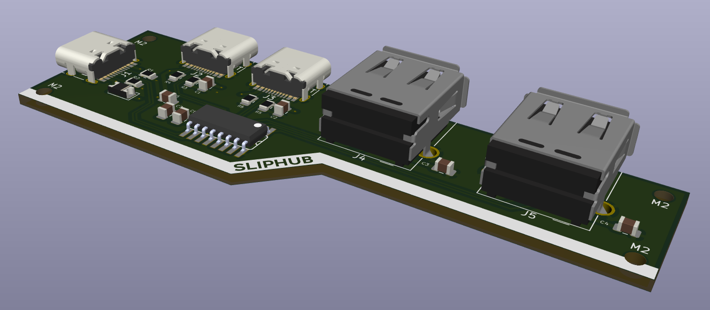

# Sliphub
A USB hub that I can slip on and off of the top of my Surface Pro! 

It has 2 USB A ports and 2 USB C ports, and will fit on the top of my surface pro alongisde my [slipboard](https://github.com/ila-io/slipboard/)! I modeled this after the design I made for that, and am hoping it's the second of a suite of slip-on accessories for my laptop :D

I made it because the surface pro only has 2 USB C ports, which is basically unusable for any considerable amount of wired devices (i.e. using it in place of a desktop with monitors, input devices, etc), and I didn't have a USB hub already! 

heres what the product looks like!

## BOM:
### PCBA BOM:
| item             | count | LCSC number | cost  | LCSC link                                                                                                                                                    |
|------------------|-------|-------------|-------|--------------------------------------------------------------------------------------------------------------------------------------------------------------|
| USB-C Receptacle |     3 | C3197885    | $2.99 | https://lcsc.com/product-detail/USB-Connectors_JAE-DX07S016JA1R1500_C3197885.html                                                                            |
| USB-A Receptacle |     2 | C2798029    | $1.63 | https://lcsc.com/product-detail/USB-Connectors_MOLEX-676430910_C2798029.html?s_z=n_USB%2520A%2520Molex%252067643                                             |
| SL2.1A           |     1 | C192893     | $0.26 | https://lcsc.com/product-detail/USB-HUB-Controllers_CoreChips-SL2-1A_C192893.html                                                                            |
| 100nF capacitor  |     5 | C48579599   | $0.25 | https://lcsc.com/product-detail/Multilayer-Ceramic-Capacitors-MLCC-SMD-SMT_AIDE-CAPACITOR-0805X7R104K101NT_C48579599.html?s_z=n_0805%2520100nf%2520capacitor |
| 10uF capacitor   |     2 | C48579582   | $0.71 | https://lcsc.com/product-detail/Multilayer-Ceramic-Capacitors-MLCC-SMD-SMT_AIDE-CAPACITOR-0805X5R106K500NT_C48579582.html?s_z=n_10uf%2520capacitor%25200805  |
| 5.1k Ω resistor  |     2 | C27834      | $0.19 | https://lcsc.com/product-detail/Chip-Resistor-Surface-Mount_UNI-ROYAL-0805W8F5101T5E_C27834.html?s_z=n_0805%25205.1k%2520ohm%2520resistor                    |
| 56k Ω resistor   |     4 | C17756      | $0.19 | https://lcsc.com/product-detail/Chip-Resistor-Surface-Mount_UNI-ROYAL-0805W8F5602T5E_C17756.html?s_z=n_0805%252056k%2520ohm%2520resistor                     |
| Diode            |     1 | C154551     | $0.57 | https://lcsc.com/product-detail/Schottky-Diodes_onsemi-SS34_C154551.html?s_z=n_SS34                                                                          |
PCBA Cost | | |$37.83

### GENERAL BOM: 
| item                   | count             | cost   | link                                                                                                                                                                                                                                                                                                                                                                                                                                                                                                                                                                                                 |
|------------------------|-------------------|--------|------------------------------------------------------------------------------------------------------------------------------------------------------------------------------------------------------------------------------------------------------------------------------------------------------------------------------------------------------------------------------------------------------------------------------------------------------------------------------------------------------------------------------------------------------------------------------------------------------|
| PCBA                   | 2 (minimum order) | $37.83 | https://jlcpcb.com                                                                                                                                                                                                                                                                                                                                                                                                                                                                                                                                                                                   |
| M2 Heatset Inserts x50 |                 1 |  $0.99 | https://www.aliexpress.us/item/3256803396040989.html?spm=a2g0o.productlist.main.1.5fe1tUQQtUQQ7l&algo_pvid=d7b60f0b-e780-4759-b797-b2f6e887de47&algo_exp_id=d7b60f0b-e780-4759-b797-b2f6e887de47-0&pdp_ext_f=%7B%22order%22%3A%2218161%22%2C%22eval%22%3A%221%22%7D&pdp_npi=4%40dis!USD!1.74!0.99!!!1.74!0.99!%402103010e17534347345916170e1408!12000026370649723!sea!US!6404024211!ABX&curPageLogUid=zXRdRmildqGP&utparam-url=scene%3Asearch%7Cquery_from%3A                                                                                                                                        |
| M2 Screws x50          |                 1 |  $0.99 | https://www.aliexpress.us/item/3256802178253461.html?spm=a2g0o.productlist.main.4.94783ca75RQUAA&aem_p4p_detail=202507261801262939809493575570002980427&algo_pvid=d776e6f8-0569-4ccb-b633-1f90a9f39bb8&algo_exp_id=d776e6f8-0569-4ccb-b633-1f90a9f39bb8-3&pdp_ext_f=%7B%22order%22%3A%22723%22%2C%22eval%22%3A%221%22%7D&pdp_npi=4%40dis%21USD%211.55%210.99%21%21%211.55%210.99%21%402103241117535780862826083e5eee%2112000020355723604%21sea%21US%216404024211%21ABX&curPageLogUid=juaZaL7nG3yR&utparam-url=scene%3Asearch%7Cquery_from%3A&search_p4p_id=202507261801262939809493575570002980427_1 |
| total:                 |                 4 | $39.81 |                                                                                                                                                                                                                                                                                                                                                                                                                                                                                                                                                                                                      |
